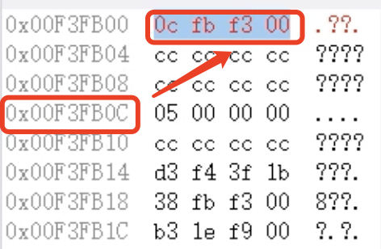
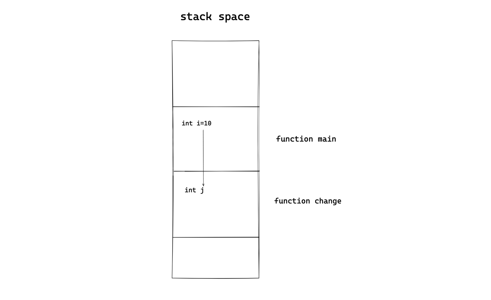
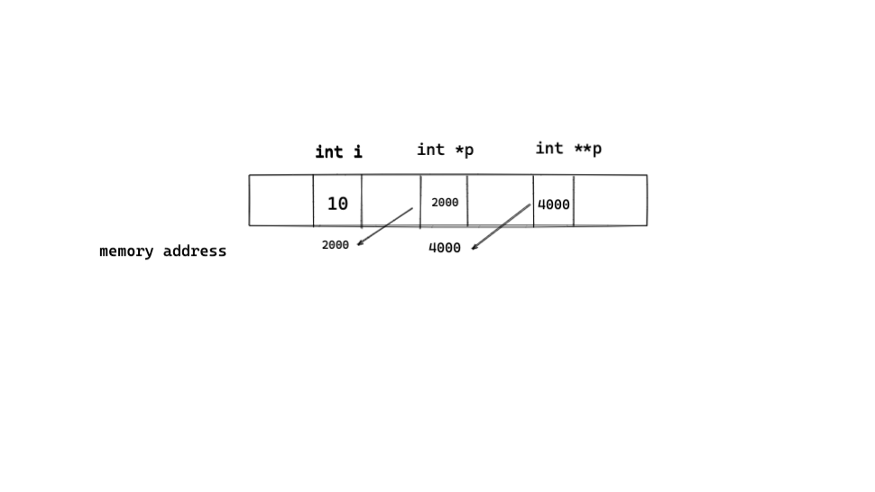

# 指针

**摘要：**

- 指针的本质
- 指针的传递和偏移
- 二级指针

```
对32位操作系统来说，有32根总线，
内存地址最多2^32个，用二进制编码地址的话应该是32个bit，也就是4个byte的大小用来存内存地址。

用16进制表示就是8个16进制数
在内存视图中查看：
	- 看到四组十六进制数
	- 每组两位
```


### 1.指针的定义

指针变量存储的内容是一个变量的内存地址

```
内存地址（针对32位操作系统）
每一个内存地址对应4字节
```

```c
#include <stdio.h>
int main(){
    int i=5;
    int *i_pointer = &i;
    // 定义一个指针变量i_pointer 存储i的内存地址
}
```



```
指针变量的初始化一定指向某个变量的内存地址
```

#### 取地址操作符与取值操作符

- 取地址操作符&，通过这个操作符可以获取一个变量的内存地址值
- 取值操作符*，可以获得一个地址对应的数据

```c
#include <stdio.h>
int main()
{
    int i = 5;
    int* p = &i;
    printf("i=%d\n",i);//直接访问
    printf("*p=%d\n",*p);//通过内存地址间接访问
}
```


**需要注意：**

- 定义指针变量时必须制定指针变量的类型，整型变量指针和浮点型变量指针不能混用

    只有整形变量的地址才能放到指向整型变量的指针变量中。


### 2. 指针的使用场景

- 传递，c语言的函数调用是值传递，实参赋值给行参
- 偏移


#### 2.1 指针的传递

**c语言函数调用采取值传递**

```c
#include <stdio.h>
void change(int j)
{
    j = 5;
}

int main()
{
    int i = 10;
    printf("before change i=%d",i);
    change(i);
    printf("after change i=%d",i);
    return 0;
}
```

```
/Users/uichuan/CLionProjects/c2022/pointer/cmake-build-debug/pointer
before change i=10
after change i=10

Process finished with exit code 0
```

当main函数开始执行时，开辟栈空间，在调用change函数时，操作系统为change函数以及其内部参数在栈空间内分配内存空间。

在调用change函数时，**实际上是将i的值赋给j（值传递）**，

**当change函数执行结束后，栈空间释放**，j被释放，i不会改变



#### 2.2 指针的偏移

**指针偏移的长度是其基类型的长度**，sizeof（ElemType）

void类型的指针无法偏移

```c
#include <stdio.h>
int main()
{
    int a[5] = {1,2,3,4,5};
    int *p; //对一个指针变量进行取值，得到的类型是其基类型
    p = a;
    printf("*p=%d\n",*p);
    for(int i=0;i<5;i++)
    {
        printf("%d\n",*(p+1));
    }    
}
```


### 3.指针与一维数组

一维数组的数组变量名存储的是数组的首地址

数组 传递时，**弱化为指针**

```c
#include <stdio.h>

void change(char *d)
{
    d[0];
}
int main()
{
    char c[10] = "hello";
    change(c);
}
```


### 4. 动态内存申请malloc

c语言的数组长度固定是因为其定义的整型，浮点型，字符型变量，数组变量都在栈空间中，

栈空间的大小在编译时是确定的，如果使用空间的大小不确定，那么就要使用堆空间。

**使用`malloc`申请的是堆空间，不会随着函数的执行结束而释放**

```c
#include <stdio.h>
int main()
{
    int i;//申请多大空间
    scanf("%d",&i);
    char *p;
    p =  (char*)malloc(i);//malloc申请空间的单位是字节
    strcpy(p,"malloc success");
    puts(p);
    free(p);//释放空间
    p = NULL;//如果不把p置为NULL，则p为野指针
    return 0;
}
```

释放空间时p的值必须和初始时一样，释放空间时指针不能偏移

```
void *p --无类型指针
malloc返回无类型指针
```


### 5. 栈空间与堆空间的差异

- 在栈空间内，系统会自动释放内存（在函数结束之后）

- 堆空间内，在程序释放空间之前，不会释放内存

```c
#include <stdio.h>
#include <stdlib.h>
#include <string.h>
char* print_stack()
{
    char c[17] = "i am print_stack";
    puts(c);
    return c;
}

char *print_malloc()
{
    char *p = (char*)malloc(30);//申请20字节堆空间，接收字符型指针
    strcpy(p,"i am print_malloc");
    puts(p);
    return p;
}
int main()
{
    char *p;
    p = print_stack();//栈空间会随着函数的执行结束而释放
    //puts(p);
    p = print_malloc(); //此处p指向堆空间，不会因为print_malloc()函数的执行结束而释放内存空间
    puts(p);
    return 0;
}
```

```c
i am print_stack
F // 产生乱码-> 内存空间已经被释放
i am print_malloc
i am print_malloc
```


### 6.字符指针与字符数组的初始化

字符指针可以初始化赋值一个字符串，字符数组初始化也可以赋值一个字符串

```c
#include <stdio.h>
#include <stdlib.h>
#include <string.h>

int main()
{
    char *p = "hello";  //把字符串型常量"hello"首地址给p
    char c[10] = "hello";//等价于strcpy(c,"hello")，栈空间内
    c[0] = 'H';//在栈空间内，可以修改
    p[0] = 'H';//指针指向的数据区域不可以修改
    p = "world";//将字符串"world"首地址赋值给指针变量p
    c = "world";//非法，c已经有固定的内存地址
       
    
    return 0;
}
```


### 7.二级指针

一级指针的使用场景是传递和偏移，

二级指针只服务于一级指针的传递和偏移。

```c
#include <stdio.h>

void change(int **pi, int *pj) {
    *pi = pj;
}

// 想要在子函数中改变一个变量的值，必须传入变量的内存地址
//同理，想要在子函数中改变一个指针变量的值，必须传入 指针变量的内存地址`
int main() {
    int i = 10;
    int j = 5;
    int *pi = &i;
    int *pj = &j;
    printf("pi_value=%d\n", *pi);
    change(&pi, pj);
    printf("pi_value=%d\n", *pi);
// &pi此时相当于二级指针，用二级指针改变pi的内容
}
```

```
pi_value=10 // 通过二级指针change前---输出pi指针指向的值
pi_value=5  // 通过二级指针change后---输出pi指针指向的值
```

```
二级指针的初始化是一级指针取地址
int **p2;
p2 = &p;	//p此时是一级指针
```





