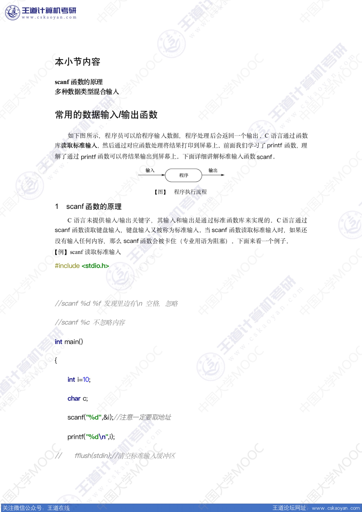

# scanf的原理

 c语言未提供输入/输出关键字，输入和输出通过标准函数库实现`stdio.h`

```cç
#include <stdio.h>
```


## 1.标准输入缓冲区（stdin）

```c
#include <stdio.h>
int main()
{
    int i;
    char c;
    scanf("%d",&i);
    printf("%d\n",i);
    scanf("%d",&i);
    printf("%c\n",c);
}
```

在输入第一个整数后，第二个scanf不会阻塞，直接运行结束

**原因：**

- 第一次输入

```
6969\n
```

输入数字后 回车，出发scanf

scanf读取整数`6969`，此时标准输入缓冲区中：

```
\n
```

- 第二次输入

读取到标准输入缓冲区中有值`\n`，直接结束进程


## 2.关于scanf

- scanf函数在读取整型，浮点数，字符串时，会忽略`\n(回车)`，` 空格`等字符

**scanf函数在执行过程中会首先删除这些字符，然后再阻塞**

scanf函数匹配一个字符时，会在缓冲区删除对应的字符，并且在整个过程中不会忽略任何一个字符包括换行符`\n`
- scanf的返回值：返回匹配成功的个数

## 3.多种数据类型混合输入

在输入字符类型`%c`时，加入空格来避免匹配错位的情况，

因为scanf在匹配字符类型`%c`的过程中，也会匹配空格符


## 4.课件




