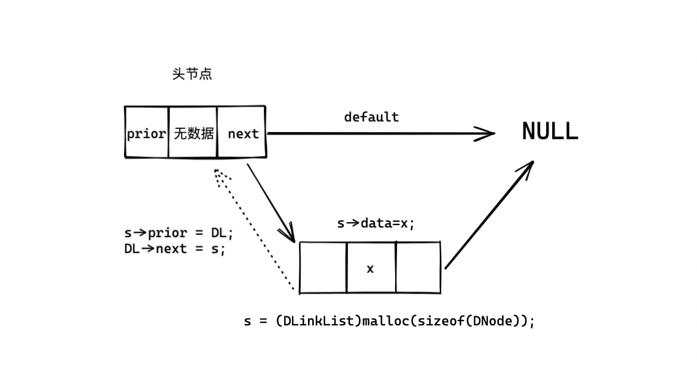

# LinearList线性表

- 线性表的顺序表示
- 线性表的链式表示


### 1.线性表

```
由n (n>=0)个相同类型元素组成的有序集合
	L = (a1,a2,...,ai)

线性表中元素的个数称为线性表的长度
- a1是唯一的“第一个”数据元素“，an是唯一的”最后一个“数据元素
- ai-1为ai的直接前驱，ai+1为ai的直接后继
```

- 元素个数有限
- 数据类型相同
- 逻辑上具有顺序性


### 2.线性表的顺序表示

**线性表顺序表示的优缺点**

```
- 优点
	- 随机存取
	- 存储密度高
- 缺点
	- 插入&删除时需要移动大量元素
	- 线性表发生较大变化时，难以确定存储空间的容量
	- 存储分配需要连续内存空间，不够灵活
```


**线性表的时间复杂度**

- 最好情况，表尾插入O（1）
- 最坏情况，表头插入 O（n）
- 平均情况，移动次数O（n/2）

>线性表的时间复杂度为O（n）


### 3.顺序表代码

**结构：**

```cpp
typedef int ElemType;

typedef struct SqList {
    ElemType data[MaxSize];
    int length;
} SqList;
void PrintSqList(SqList L){...}
bool InsertSqList(SqList &L, int pos, ElemType val){...}
bool DelSqList(SqList &L, int pos, ElemType &val){...}
bool GetSqList(SqList L, ElemType num, ElemType &val){...}
int main() {
    SqList L;
    L.data[0] = 1;
    L.data[1] = 2;
    L.data[2] = 3;
    L.length = 3;
    PrintSqList(L);
    //增加
    InsertSqList(L, 2, 99);
    PrintSqList(L);
    //删除
    ElemType DelValue;
    DelValue = DelSqList(L, 2, DelValue);
    PrintSqList(L);
    //查询
    ElemType GetRes;
    GetSqList(L,3,GetRes);
    printf("查询的数字是%d\n",GetRes);
    return 0;
}    
```

**全部代码：**

```cpp
#include <stdio.h>

#define MaxSize 50
typedef int ElemType;

typedef struct SqList {
    ElemType data[MaxSize];
    int length;
} SqList;

void PrintSqList(SqList L) {
    for (int i = 0; i < L.length; i++) {
        printf("%3d", L.data[i]);
    }
    printf("\n");
}

bool InsertSqList(SqList &L, int pos, ElemType val) {
    if (pos < 1 || pos > L.length + 1) {
        return false;
    }
    if (L.length > MaxSize) {
        return false;
    }
    for (int j = L.length; j >= pos; j--) {
        L.data[j] = L.data[j - 1];
    }
    L.data[pos - 1] = val;
    L.length++;
    return true;
}

bool DelSqList(SqList &L, int pos, ElemType &val) {
    if (pos < 1 || pos > L.length + 1) {
        return false;
    }
    val = L.data[pos - 1];
    for (int i = pos - 1; i < L.length; i++) {
        L.data[i] = L.data[i + 1];
    }
    L.length--;
    return true;
}

bool GetSqList(SqList L, ElemType num, ElemType &val) {
    for (int i = 0;i<L.length;i++)
    {
        if(L.data[i] == num)
        {
            val = L.data[i];
            return true;
        }
    }
    val = 404;
    return false;
}

int main() {
    SqList L;
    L.data[0] = 1;
    L.data[1] = 2;
    L.data[2] = 3;
    L.length = 3;
    PrintSqList(L);
    //
    InsertSqList(L, 2, 99);
    PrintSqList(L);
    //
    ElemType DelValue;
    DelValue = DelSqList(L, 2, DelValue);
    PrintSqList(L);
    //
    ElemType GetRes;
    GetSqList(L,3,GetRes);
    printf("查询的数字是%d\n",GetRes);
    return 0;
}
```


### 4.线性表的链式表示

**链式存储：**逻辑上相邻的两个元素在物理位置上不相邻

**与顺序表相比：**

- 插入和删除不需要移动元素，只需要修改指针
- 不需要连续的大量内存空间
- 单个结构体需要存储指针域
- 不支持随机存取

> 以下例子为带有头节点的链表

链表节点结构体：

```cpp
typedef int element_type;
typedef struct Lnode{
    element_type data; //本节点的数据
    struct Lnode *next; //下一个节点的指针
}LNode,*LinkList;
//Lnode为结构体，LinkList为结构体指针
```


#### 4.1 头插法建立单链表


```cpp
#include <stdio.h>
#include <stdlib.h>

typedef int ElemType;
typedef struct LinkNode {
    ElemType data;
    struct LinkNode *next;
} LinkNode, *LinkList;

void PrintList(LinkList L)
{
    L = L->next;
    while (L != NULL){
        printf("%3d",L->data);
        L = L->next;
    }
}

LinkList HeadInsert(LinkList &L) {
    LinkList newNode; //声明新节点指针
    int x;
    L = (LinkList) malloc(sizeof(LinkNode));//初始化头节点
    L->next = NULL;
    scanf("%d", &x);
    while (x != 9999) {
        newNode = (LinkList) malloc(sizeof(LinkNode));//分配新节点空间
        newNode->data = x;//新节点赋值
        newNode->next = L->next;
        L->next = newNode;
        scanf("%d",&x);
    }
}

int main() {
    LinkList testHeadInsert;
    HeadInsert(testHeadInsert);
    PrintList(testHeadInsert);
    return 0;
}
```


#### 4.2 尾插法建立单链表


**在尾插法中，需要多用一个指针（LinkList类型）来表示表尾元素的位置，**

本实例中，与新节点的指针一同定义

```cpp
#include <stdio.h>
#include <stdlib.h>

typedef int ElemType;
typedef struct LinkNode {
    ElemType data;
    struct LinkNode *next;
} LinkNode, *LinkList;

void PrintList(LinkList L)
{
    L = L->next;
    while (L != NULL){
        printf("%3d",L->data);
        L = L->next;
    }
}

LinkList TailInsert(LinkList &L)
{
    LinkList newNode,pointer; //声明新节点，以及标识表尾的指针
    int x;
    L = (LinkList) malloc(sizeof (LinkNode)); //初始化头节点
    pointer = L; //指针此时指向头节点
    scanf("%d",&x);
    while (x!=9999)
    {
        newNode = (LinkList) malloc(sizeof (LinkNode));//初始化新节点
        newNode->data = x;//新节点赋值
        newNode->next = pointer->next;
        pointer->next = newNode;
        pointer = newNode;//更新指针又重新指向新的表尾
        scanf("%d",&x);
    }
    return L;
}

int main() {
    LinkList testTailInsert;
    TailInsert(testTailInsert);
    PrintList(testTailInsert);
    return 0;
}
```


#### 4.3 单链表查询（按位置）

```cpp
LinkList GetElem(LinkList L, int pos) {
    int j = 1;
    LinkList p = L->next;
    if (pos == 0)
        return L;
    if(pos<1){
        return NULL;
    }
    while(p&&j<pos)
    {
        p = p->next;
        j++;
    }
    return p;
}
```


#### 4.4 单链表查询（按值）

```cpp
LinkList LocateElem(LinkList L,ElemType val)
{
    LinkList p = L->next;
    while (p!=NULL && p->data !=val)
    {
        p = p->next;
    }
    return p;
}
```

#### 4.5 插入新节点

```cpp
bool InsertElem(LinkList L,int pos,ElemType val)
{
    LinkList before = GetElem(L,pos-1); //获取新节点前一个节点的指针
    if (before == NULL)
    {
        return false;
    }
    LinkList newNode;
    newNode = (LinkList)malloc(sizeof (LinkNode));//给新节点分配空间
    newNode->data = val;
    newNode->next = before->next;
    before->next = newNode;
    return true;
}
```


#### 4.6 删除节点

```cpp
bool DelElem(LinkList L,int pos)
{
    LinkList before = GetElem(L,pos-1);
    printf("before=%3d\n",before->data);
    if(before == NULL)
    {
        return false;
    }
    LinkList current = before->next; //中间指针变量的创建
    before->next = current->next;
    free(current);
    current = NULL;
    return true;
}
```

在删除节点的过程中，**需要借助一个中间指针变量current来记录此时删除的节点**，

因为需要通过current节点访问before节点的后继的后继


### 5.双向链表

**双向链表结构体的定义**

```cpp
typedef int element_type
typedef struct DNode{
    ElemType data; //数据域
    struct DNode *prior; //前驱指针
    struct DNode *next; //后继指针
}DNode,*DinkList;
```

双链表的结构包括，含有空数据的头指针，以及之后的 每一个包含数据的结构体节点。

双链表的一个结构体节点占12个字节的空间

```
头节点（无数据的节点）只有后继指针，不成为前驱指针指向的对象
```

#### 

#### 5.1双向链表头插法




```cpp
DLinkList ListHeadInsert(DLinkList &DL)
{
    DNode *s;
    int x;
    DL = (DLinkList)malloc(sizeof(DNode));
    DL->next = NULL;
    DL->prior = NULL;
    scanf("%d",&x);
    while(x!=9999)
    {
        s = (DLinkList)malloc(sizeof(DNode));
        //建立新的数据节点，结构体（指针）
        s->data=x;
        s->next = DL->next;
        if(DL->next != NULL)
        {
            DL->next->prior = s;
        }
        s->prior = DL; //unnecessary own opinion
        DL->next = s;
        scanf("%d",&x);
    }
    return DL;
}
```


#### 5.2 双向链表尾插法


```cpp
DLinkList DlistTailInsert(DLinkList &DL)
{
    int x;
    DL = (DLinkList)malloc(sizeof(DNode));
    DNode *s;
    DNode *r = DL;
    DL-> = NULL;
    scanf("%d",&x);
    while(x!=9999)
    {
        s = (DNode*)malloc(sizeof(DNode));
        s->data = x;
        r->next = s;
        s->prior = r;
        r=s;
        scanf("%d",&x);
    }
    r->next = NULL;
    return DL;
}
```


#### 5.3 双向链表遍历

```cpp
void PrintDList(DLinkList DL)
{
    DL = DL ->next;
    while(DL != NULL)
    {
        printf("%3d",DL->data);
        DL = DL->next;
    }
    printf("\n");
}
```


#### 5.4 双向链表插入元素


```cpp
bool DListFrontInsert(DLinkList DL,int i,element_type)
{
    DLinkList p = *get_element(DL,i-1);
    if (p==NULL)
    {
        return false;
    }
    DLinkList s = (DLinkList)malloc(sizeof(DNode));
    s->data = e;
    s->next = p->next;
    p->next->prior=s;
    p->next = s;
    s->prior = p;
    return true;
}
```


#### 5.5 双向链表删除元素


```cpp
bool DListDelete(DLinkList DL,int i)
{
    DLinkList p = *get_element(DL,i-1);
    if(p==NULL)
    {
        return false;
    }
    DLinkList q;
    q = p->next;
    if (q==NULL)
    {
        return false;
    }
    p->next = q->next;
    if(q->next != NULL)
    {
        q->next->prior = p;
    }
    free(p);
    return true;
}
```


```cpp
int main() {
    LinkList L;
//    List_HeadInsert(L);
    List_TailInsert(L);
    LNode L1;
    int res;
    L1 = *get_element(L,2);
    res = L1.data;
    printf("%d\n",res);
}
```


### 6.LinkList-2019-41

#### **题目**

41.(13分) 设线性表L=（a1,a2,a3,...,an）采用带头节点的链表保存，链表结构体定义如下

```cpp
typedef struct node{
    int data;
    struct node *next;
}NODE;
```

请设计一个空间复杂度为O(1)并且时间上尽可能高效的算法，重新排列L中的节点，

得到线性表L'=（a1,an,a2,an-1,a3,an-1,...）

- 给出算法设计基本思想
- 用C/C++描述算法
- 说明时间复杂度

#### 设计思想


#### 代码

```cpp
#include <stdio.h>
#include <stdlib.h>

typedef int element_type;
typedef struct Lnode {
    element_type data;
    struct Lnode *next;
} LinkNode, *LinkList;

void PrintList(LinkList L) {
    L = L->next;
    while (L != NULL) {
        printf("%3d", L->data);
        L = L->next;
    }
    printf("\n");
}

LinkList TailInsert(LinkList &L) {
    LinkList newNode, pointer;
    int x;
    L = (LinkList) malloc(sizeof(LinkNode));
    pointer = L;
    scanf("%d", &x);
    while (x != 9999) {
        newNode = (LinkList) malloc(sizeof(LinkNode));
        newNode->data = x;
        newNode->next = pointer->next;
        pointer->next = newNode;
        pointer = newNode;
        scanf("%d", &x);
    }
    return L;
}

//找链表中间节点
void FindMiddle(LinkList L, LinkList &L2) {
    L2 = (LinkList) malloc(sizeof(LinkNode));
    // 双指针法找中间节点
    LinkList pcur, ppre;
    pcur = L->next;
    ppre = L->next;
    while (pcur) {
        pcur = pcur->next;
        //pcur一次向前两个节点，要判断下一个节点是否存在
        if (pcur == NULL) {
            break;
        }
        pcur = pcur->next;
        // 偶数情况下，保证ppre不向前移动
        if (pcur == NULL) {
            break;
        }
        ppre = ppre->next;
    }
    // L2头节点指向后面一半链表
    L2->next = ppre->next;
    //前一半链表断开
    ppre->next = NULL;
}

void reverse(LinkList L2) {
    LinkList r, s, t;
    r = L2->next;
    // 第二段链表为空
    if (r == NULL) {
        return;
    }
    s = r->next;
    //链表只有一个节点
    if (s == NULL) {
        return;
    }
    t = s->next;
    while (t) {
        s->next = r;
        r = s;
        s = t;
        t = t->next;
    }
    s->next = r;
    L2->next->next = NULL;
    L2->next = s;
}

void merge(LinkList L, LinkList L2) {
    LinkList pcur, p, q;
    //pcur始终指向新链表的链表尾
    pcur = L->next;
    p = pcur->next;
    q = L2->next;
    while (p != NULL && q != NULL) {
        //先放后半段链表的一个元素
        pcur->next = q;
        pcur = pcur->next;
        q = q->next;
        //放前一段链表的一个元素
        pcur->next = p;
        pcur = pcur->next;
        p = p->next;
    }
    if (p != NULL) {
        pcur->next = p;
    }
    if (q != NULL) {
        pcur->next = q;
    }
}

int main() {
    LinkList L;
    LinkList search;
    TailInsert(L);
    PrintList(L);
    LinkList L2;
    FindMiddle(L, L2);
    printf("--------FindeMiddle--------\n");
    PrintList(L);
    PrintList(L2);
    printf("--------reverse--------\n");
    reverse(L2);
    PrintList(L);
    PrintList(L2);
    printf("--------merge--------\n");
    merge(L,L2);
    PrintList(L);
    return 0;
}
```

**测试结果**

```
/Users/uichuan/Documents/library/DataStructure/codes/LinkList_example01/cmake-build-debug/LinkList_example01
1 2 3 4 5 9999
  1  2  3  4  5
--------FindeMiddle--------
  1  2  3
  4  5
--------reverse--------
  1  2  3
  5  4
--------merge--------
  1  5  2  4  3

Process finished with exit code 0
```

```
/Users/uichuan/Documents/library/DataStructure/codes/LinkList_example01/cmake-build-debug/LinkList_example01
1 2 3 4 5 6 9999
  1  2  3  4  5  6
--------FindeMiddle--------
  1  2  3
  4  5  6
--------reverse--------
  1  2  3
  6  5  4
--------merge--------
  1  6  2  5  3  4

Process finished with exit code 0
```

#### 时间复杂度

```
O(1)
```

