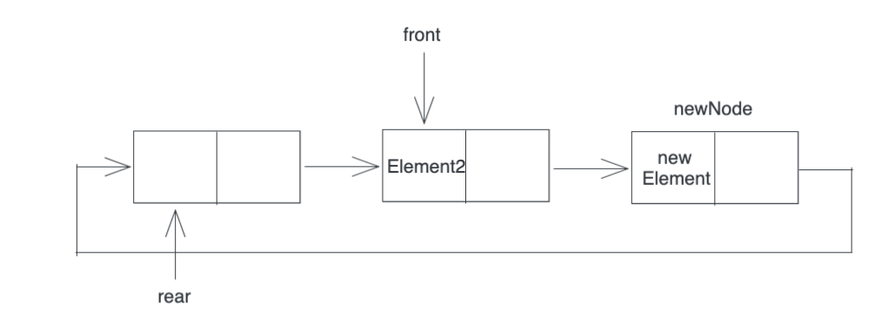

# 队列

队列是一种操作受到约束的线性表，只允许在表的一段进行插入，在表的另一端进行删除

向队列中插入元素成为入队，删除元素称为出队


### 1. 循环队列


```
在循环队列中判断队列是否已经满
牺牲一个位置的存储单元为空
如果 rear + 1 == front
即队尾的指针+1等于队头 时，循环队列已满
```

```
再次需要注意：
	front指向的位置总是存有元素，而且是先入队的元素
	rear指向的位置没有元素，rear总是指向最后一个元素的下一个位置
```


### 2.顺序表实现循环队列

```cpp
int main() {
    SqQueue SQ;
    bool res;
    ElemType element;
    InitQueue(SQ);
    EnQueue(SQ,1);
    EnQueue(SQ,2);
    EnQueue(SQ,3);
    DeQueue(SQ,element);
    printf("DeQueue->%d\n",element);
    DeQueue(SQ,element);
    printf("DeQueue->%d\n",element);
    return 0;
}
```


```cpp
#define MaxSize 5
typedef int ElemType;
typedef struct SqQueue{
    ElemType data[MaxSize]; //数组，循环队列最存储MaxSize-1个元素
    int front,rear; //队列头，队列尾
}SqQueue;
```

```cpp
void InitQueue(SqQueue &Q)
{
    Q.front = Q.rear = 0; //初始化队列
}
```

```cpp
bool isEmpty(SqQueue Q)
{
    if(Q.front == Q.rear)
    {
        return true;
    }
    return false;
}
```

#### 2.1 入队

```cpp
bool EnQueue(SqQueue &Q,ElemType x)
{
    if ((Q.rear+1) % MaxSize == Q.front)
    {
        return false; //队列满，不能入队
    }
    Q.data[Q.rear] = x;
    Q.rear = (Q.rear + 1) % MaxSize; // 添加完一个元素以后，队尾向后移动一个单位
    return true;
}
```

#### 2.2 出队

```cpp
bool DeQueue(SqQueue &Q,ElemType &x)
{
    if(Q.front == Q.rear) // 判断队列是否为空
    {
        return false;
    }
    x = Q.data[Q.front];
    Q.front = (Q.front + 1) % MaxSize;
    return true;
}
```


### 3.链表实现队列


采用带有头节点（front）的单链表存储队列，也可以实现先入先出，每次删除第一个节点（front指针所指向的节点）

```cpp
int main() {
    LinkQueue Q;
    InitQueue(Q);
    EnQueue(Q, 1);
    EnQueue(Q, 2);
    EnQueue(Q, 3);
    EnQueue(Q, 4);
    bool res;
    ElemType element;
    res = DeQueue(Q, element);
    if (res) {
        printf("deQueue success element=%d\n", element);
    } else {
        printf("deQueue unsuccess\n");
    }
    return 0;
}
```


#### 3.1 链表队列初始化

```cpp
#include <stdio.h>
#include <stdlib.h>

typedef int ElemType;
typedef struct LinkNode {
    ElemType data;
    struct LinkNode *next;
} LinkNode;

typedef struct {
    LinkNode *front, *rear;
} LinkQueue;

//带头节点的链表实现队列
void InitQueue(LinkQueue &Q) {
    Q.front = Q.rear = (LinkNode *) malloc(sizeof(LinkNode));
    Q.front->next = NULL;
}
```


#### 3.2 入队

```cpp
void EnQueue(LinkQueue &Q, ElemType x) {
    LinkNode *newNode = (LinkNode *) malloc(sizeof(LinkNode));
    newNode->data = x;
    newNode->next = NULL;
    Q.rear->next = newNode;
    Q.rear = newNode;
}
```

#### 3.3 出队

```cpp
bool DeQueue(LinkQueue &Q, ElemType &element) {
    //队列为空
    if (Q.rear == Q.front) {
        return false;
    }
    LinkNode *q = Q.front->next;
    element = q->data;
    Q.front->next = q->next;
    if (q == Q.rear) {
        Q.rear = Q.front;
    }
    free(q);
    return true;
}
```


### 3.Queue-2019-42

#### 题目

42.（10分）请设计一个队列，要求满足：1.初始时队列为空；2.入队时，允许增加队列占用空间；3.出队后，出队元素所占用的空间可以**重复利用**，即整个队列所占用的空间只增不减；4.入队操作和出队操作时间复杂度为O（1）。

回答以下问题：

1. 该队列选择**链式存储**还是顺序存储？
2. 画出队列的初始状态，并给出判断队空和队满的条件
3. 画出第一个元素入队后的队列状态
4. 给出入队操作和出队操作的基本过程


#### (1)链式存储

#### (2)初始状态

**画出队列的初始状态，并给出判断队空和队满的条件**

​	初始时，创建只有一个空闲节点的链表，rear，front指针都指向第一个空闲的节点


新增一个元素之后：


队空的判定条件：front=rear

队满的判定条件：front=rear->next

#### (3)第一个元素入队


在插入一个元素之后，一定要**确保当前节点的next是下一个空节点**


#### (4)入队和出队操作

出队操作：

移除front指针指向的节点存储的元素，并将front指针向前移动front=front->next


入队操作：

将新元素Element放在Element2之后，同时将rear指向之前移除元素的节点



```
入队操作:
if(front=rear->next) // 队满
{
	在rear之后插入一个新节点
}
入队元素保存在rear所指向的节点中;
rear=rear->next;

出队操作:
if (front == rear) //队空
{
	出队失败return;
}
// 如果对列不为空
取front所指向的元素element，front前移 front=front->next;
return element;
```


### 4.链表实现循环队列

#### 4.1 定义

```cpp
#include <stdio.h>
#include <stdlib.h>

typedef int ElemType;
typedef struct LNode {
    ElemType data;
    struct LNode *next;
} LNode, *LinkList;

void CircleQueue(LinkList &front, LinkList &rear) {
    //进行初始化
    front = (LinkList) malloc(sizeof(LNode));
    rear = front;
    rear->next = front;

    //入队两个元素
    EnQueue(front,rear,3);
    EnQueue(front,rear,4);

    //出队
    Dequeue(front,rear);
    Dequeue(front,rear);
    Dequeue(front,rear);
}


int main() {
    LinkList front, rear;
    CircleQueue(front, rear);
}
```

#### 4.2 入队

```cpp
void EnQueue(LinkList front, LinkList &rear, ElemType val) {
    LinkList pnew;
    if (rear->next == front) {
        //rear当前是空节点，如果rear->next== front，说明队列满
        //申请新节点
        pnew = (LinkList) malloc(sizeof(LNode));
        //插入的元素放在rear节点中，而不放在新申请的空节点中
        rear->data = val;
        rear->next = pnew;
        pnew->next = front;
        rear = pnew;
    } else {
        //队列不满，直接放值，rear后移一个节点
        rear->data = val;
        rear = rear->next;
    }
}
```


#### 4.3 出队

```cpp
void Dequeue(LinkList &front,LinkList rear)
{
    if (front==rear)
    {
        printf("empty queue\n");
    }else{
        printf("Dequeue->%d\n",front->data);
        front=front->next;
    }
}
```

