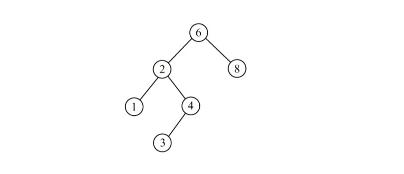

# 查找算法


### 1.顺序查找

顺序查找又称为线性查找，对于顺序表和链表都适用。

这里的顺序查找适用的**哨兵：**

将要查找的数组的第0个位置留给哨兵，从后向前循环，可以更加简洁

```cpp
ElemType ST_Search(SSTable ST, ElemType key)
{
    ST.elem[0] = key;
    int i;
    for (i = ST.TableLen-1; ST.elem[i] != ST.elem[0] ;i--) {
    }
    return i;
}
```

**全部代码：**

```cpp
#include <stdio.h>
#include <stdlib.h>
#include <time.h>

typedef int ElemType;
typedef struct SSTable{
    ElemType *elem;
    int TableLen;
};

void ST_Init(SSTable &ST,int length)
{
    ST.TableLen = length + 1;
    ST.elem = (ElemType*) malloc(sizeof (SSTable) * ST.TableLen);
    int i;
    srand(time(NULL));
    for (i=1;i<ST.TableLen;i++)
    {
        ST.elem[i] = rand() % 100;
    }
}


void ST_Print(SSTable ST)
{
    for (int i = 1; i < ST.TableLen; ++i) {
        printf("%3d",ST.elem[i]);
    }
    printf("\n");
}

ElemType ST_Search(SSTable ST, ElemType key)
{
    ST.elem[0] = key;
    int i;
    for (i = ST.TableLen-1; ST.elem[i] != ST.elem[0] ;i--) {
    }
    return i;
}
int main() {
    SSTable ST;
    ST_Init(ST,15);
    ST_Print(ST);
    ElemType res;
    ElemType key;
    scanf("%d",&key);
    res= ST_Search(ST,key);
    if (res)
    {
        printf("search_res->%d\n",res);
    } else{
        printf("not find\n");
    }
    return 0;
}
```


### 2.二分查找

[二分查找演示🎈](https://www.cs.usfca.edu/~galles/visualization/Search.html)

**二分查找也叫折半查找**，它仅仅是用于**有序的顺序表**

二分查找的基本思想：

1. 将给定的key与表中间位置的元素比较，如果相同->查找成功
2. 如果不同，在中间元素的前半段或后半段分别进行第一步的操作，直到查找成功
3. 如果实在没有找到元素，则查找不成功


演示的过程：

1. 初始化顺序表，放入10个元素
2. 适用qsort接口进行排序，并打印
3. 进行查找

**二分查找代码：**

```cpp
ElemType BinarySearch(SSTable L,ElemType key)
{
    int low=0;
    int high=L.TableLen-1;
    int mid;
    while (low<=high)
    {
        mid=(low+high)/2;
        if(key>L.elem[mid])
        {
            low=mid+1;
        } else if(key<L.elem[mid])
        {
            high=mid-1;
        } else{
            return mid;
        }
    }
    return -1;
}
```


**全部代码：**

```cpp
#include <stdio.h>
#include <stdlib.h>
#include <time.h>

typedef int ElemType;
typedef struct SSTable{
    ElemType *elem;
    int TableLen;
};

void ST_Init(SSTable &ST,int length)
{
    ST.TableLen = length;
    ST.elem = (ElemType*) malloc(sizeof (SSTable) * ST.TableLen);
    int i;
    srand(time(NULL));
    for (i=0;i<ST.TableLen;i++)
    {
        ST.elem[i] = rand() % 100;
    }
}


void ST_Print(SSTable ST)
{
    for (int i = 0; i < ST.TableLen; ++i) {
        printf("%3d",ST.elem[i]);
    }
    printf("\n");
}

ElemType BinarySearch(SSTable L,ElemType key)
{
    int low=0;
    int high=L.TableLen-1;
    int mid;
    while (low<=high)
    {
        mid=(low+high)/2;
        if(key>L.elem[mid])
        {
            low=mid+1;

        } else if(key<L.elem[mid])
        {
            high=mid-1;
        } else{
            return mid;
        }
    }
    return -1;

}

//函数名中存的是函数的入口地址，也是一个指针（函数指针）
//qsort规定如果left指针指向的值大于right指针指向的值，返回正值，否则返回负
int compare(const void *left,const void *right)
{
    return *(int*)left-*(int*)right;
}

int main() {
    SSTable ST;
    ST_Init(ST,10);
    ST_Print(ST);
    qsort(ST.elem,ST.TableLen,sizeof (ElemType),compare);
    ST_Print(ST);
    ElemType key;
    printf("please input search key:\n");
    scanf("%d",&key);
    int res;
    res = BinarySearch(ST,key);
    if (res!=-1)
    {
        printf("search res->%d\n",res);
    } else{
        printf("not find\n");
    }
    return 0;
}
```


**qsort接口**

```c
void qsort(void *base, size_t nitems, size_t size, int (*compar)(const void *, const void*))
```

- base --指向要排序数组的指针
- nitems --数组中元素的个数
- size -- 数组中每个元素的大小 (sizeof(int))
- compar -- 比较两个元素的函数，返回值必须是指定类型(这里是int)

> qsort规定如果left指针指向的值大于right指针指向的值，返回正值，否则返回负，相等返回0

**qsort接口的例子：**

```c
#include <stdio.h>
#include <stdlib.h>

int values[] = { 88, 56, 100, 2, 25 };

int cmpfunc (const void * a, const void * b)
{
   return ( *(int*)a - *(int*)b );
}

int main()
{
   int n;

   printf("排序之前的列表：\n");
   for( n = 0 ; n < 5; n++ ) {
      printf("%d ", values[n]);
   }

   qsort(values, 5, sizeof(int), cmpfunc);

   printf("\n排序之后的列表：\n");
   for( n = 0 ; n < 5; n++ ) {
      printf("%d ", values[n]);
   }
  
  return(0);
}
```

运行结果：

```
排序之前的列表：
88 56 100 2 25 
排序之后的列表：
2 25 56 88 100
```


### 3.二叉查找树

[二叉排序树演示🎈](https://www.cs.usfca.edu/~galles/visualization/BST.html)

二叉查找树也叫二叉排序树，或者是一棵空树。

具有以下的特性：

- 如果左子树非空，则左子树上所有结点的值均小于根结点
- 如果右子树非空，则右子树上所有结点的值均大于根结点
- 左右子树也分别是一棵二叉排序树

> 看任何一个最小单元的树的组成部分，左孩子结点小于根节点，右孩子结点大于根结点

例如：



使用二叉查找树查找元素，查找的最多次数就是树的高度。

中序遍历二叉查找树，得到的是从小到大的结果

#### 1.非递归建立二叉查找树

- parent节点用来指示要插入的位置的父亲节点
- 当找到为NULL的p节点时，跳出循环

```cpp
void Creat_BST(BiTree &T, KeyType *str, int len) {
    int i;
    for (i = 0; i < len; i++) {
        BST_Insert(T, str[i]);
    }
}

int BST_Insert(BiTree &T, KeyType k) {
    BiTree TreeNew = (BiTree) calloc(1, sizeof(BSTNode));
    TreeNew->Key=k;
    if (NULL==T)
    {
        T=TreeNew;
        return 0;
    }
    //用来遍历树
    BiTree p=T,parent;
    while (p)
    {
        parent=p;
        if (k>p->Key)
        {
            p=p->rchild;
        } else if (k<p->Key)
        {
            p=p->lchild;
        } else{
            //相等的元素不放入查找树，返回-1
            return -1;
        }
    }
    if (k>parent->Key)
    {
        parent->rchild=TreeNew;
    } else{
        parent->lchild=TreeNew;
    }
    return 0;
}
```


#### 2.递归建立二叉查找树

```cpp
int RecurveBST_Insert(BiTree &T,KeyType k)
{
    if (NULL==T)
    {
        T=(BiTree) malloc(sizeof (BSTNode));
        T->Key=k;
        T->lchild=T->rchild=NULL;
        return 1;
    } else if(k==T->Key)
    {
        return 0;
    } else if (k<T->Key)
    {
        return BST_Insert(T->lchild,k);
    } else{
        return BST_Insert(T->rchild,k);
    }
}
```

>函数int RecurveBST_Insert(BiTree &T,KeyType k)传入引用类型

**在递归过程中，递归时传入的参数依然是引用类型**


#### 3.使用二叉查找树查找

```cpp
BiTree BST_Search(BiTree T,KeyType k,BiTree &parent)
{
    parent=NULL;
    while (T!=NULL && k!=T->Key)
    {
        parent=T;
        if (k>T->Key)
        {
            T=T->rchild;
        } else{
            T=T->lchild;
        }
    }
    return T;
}
```


**全部代码：**

```cpp
#include <stdio.h>
#include "stdlib.h"

//二叉排序树

typedef int KeyType;
typedef struct BSTNode {
    KeyType Key;
    struct BSTNode *lchild, *rchild;
} BSTNode, *BiTree;

//非递归创建二叉查找树
int BST_Insert(BiTree &T, KeyType k) {
    BiTree TreeNew = (BiTree) calloc(1, sizeof(BSTNode));
    TreeNew->Key=k;
    if (NULL==T)
    {
        T=TreeNew;
        return 0;
    }
    //用来遍历树
    BiTree p=T,parent;
    while (p)
    {
        parent=p;
        if (k>p->Key)
        {
            p=p->rchild;
        } else if (k<p->Key)
        {
            p=p->lchild;
        } else{
            //相等的元素不放入查找树，返回-1
            return -1;
        }
    }
    if (k>parent->Key)
    {
        parent->rchild=TreeNew;
    } else{
        parent->lchild=TreeNew;
    }
    return 0;
}

void Creat_BST(BiTree &T, KeyType *str, int len) {
    int i;
    for (i = 0; i < len; i++) {
        BST_Insert(T, str[i]);
    }
}


void InOrder(BiTree T)
{
    if (T!=NULL)
    {
        InOrder(T->lchild);
        printf("%3d",T->Key);
        InOrder(T->rchild);
    }

}


BiTree BST_Search(BiTree T,KeyType k,BiTree &parent)
{
    parent=NULL;
    while (T!=NULL && k!=T->Key)
    {
        parent=T;
        if (k>T->Key)
        {
            T=T->rchild;
        } else{
            T=T->lchild;
        }
    }
    return T;
}

int RecurveBST_Insert(BiTree &T,KeyType k)
{
    if (NULL==T)
    {
        T=(BiTree) malloc(sizeof (BSTNode));
        T->Key=k;
        T->lchild=T->rchild=NULL;
        return 1;
    } else if(k==T->Key)
    {
        return 0;
    } else if (k<T->Key)
    {
        return BST_Insert(T->lchild,k);
    } else{
        return BST_Insert(T->rchild,k);
    }
}
int main() {
    BiTree T = NULL;
    KeyType str[7] = {54, 20, 66, 40, 28, 79, 58};
    Creat_BST(T, str, 7);
    InOrder(T);
    printf("\n");
    BiTree res,parent;
    res=BST_Search(T,40,parent);
    if (res)
    {
        printf("find res->%d\n",res->Key);
    } else{
        printf("not find\n");
    }
    return 1;
}
```

**运行结果：**

```
/Users/uichuan/Documents/library/DataStructure/codes/search/BinarySearchTree/cmake-build-debug/BinarySearchTree
 20 28 40 54 58 66 79
find res->40
```


#### 4.二叉查找树删除元素

**逻辑过程：**

1. 首先定位到要删除的结点，根结点如果大于要删除的元素，走左子树，否则走右子树
2. 判断要删除的结点的子结点是否为空
3. 如果左结点为空（左右结点都为空），将删除节点的父亲节点指向右孩子节点
4. 如果右结点为空，将删除节点的父亲节点指向左孩子节点
5. 如果左右孩子节点都不为空

- 找左子树的最右孩子节点放在要删除元素的位置
- 这样可以保证树还是一棵二叉查找树

```cpp
void DeleteNode(BiTree &root,KeyType x)
{
    if (NULL==root)
    {
        return;
    }
    if (root->Key>x)
    {

        DeleteNode(root->lchild,x);
    } else if (root->Key<x)
    {

        DeleteNode(root->rchild,x);
    } else{
        //找到了要删除的节点
        if (root->lchild==NULL)
        {
            BiTree tmpNode=root;
            root=root->rchild;
            free(tmpNode);
        } else if (root->rchild==NULL)
        {
            BiTree tmpNode=root;
            root=root->lchild;
            free(tmpNode);
        }else{
            //左右子树都不为空
            BiTree tmpNode=root->lchild;
            while (tmpNode->rchild!=NULL)
            {
                tmpNode=tmpNode->rchild;
            }
            root->Key=tmpNode->Key;
            DeleteNode(root->lchild,tmpNode->Key);
        }
    }
}
```

**全部代码：**

```cpp
#include <stdio.h>
#include "stdlib.h"

//二叉排序树

typedef int KeyType;
typedef struct BSTNode {
    KeyType Key;
    struct BSTNode *lchild, *rchild;
} BSTNode, *BiTree;

//非递归创建二叉查找树
int BST_Insert(BiTree &T, KeyType k) {
    BiTree TreeNew = (BiTree) calloc(1, sizeof(BSTNode));
    TreeNew->Key=k;
    if (NULL==T)
    {
        T=TreeNew;
        return 0;
    }
    //用来遍历树
    BiTree p=T,parent;
    while (p)
    {
        parent=p;
        if (k>p->Key)
        {
            p=p->rchild;
        } else if (k<p->Key)
        {
            p=p->lchild;
        } else{
            //相等的元素不放入查找树，返回-1
            return -1;
        }
    }
    if (k>parent->Key)
    {
        parent->rchild=TreeNew;
    } else{
        parent->lchild=TreeNew;
    }
    return 0;
}
int RecurveBST_Insert(BiTree &T,KeyType k)
{
    if (NULL==T)
    {
        T=(BiTree) malloc(sizeof (BSTNode));
        T->Key=k;
        T->lchild=T->rchild=NULL;
        return 1;
    } else if(k==T->Key)
    {
        return 0;
    } else if (k<T->Key)
    {
        return BST_Insert(T->lchild,k);
    } else{
        return BST_Insert(T->rchild,k);
    }
}

void Creat_BST(BiTree &T, KeyType *str, int len) {
    int i;
    for (i = 0; i < len; i++) {
        BST_Insert(T, str[i]);
//        RecurveBST_Insert(T,str[i]);
    }
}


void InOrder(BiTree T)
{
    if (T!=NULL)
    {
        InOrder(T->lchild);
        printf("%3d",T->Key);
        InOrder(T->rchild);
    }

}


BiTree BST_Search(BiTree T,KeyType k,BiTree &parent)
{
    parent=NULL;
    while (T!=NULL && k!=T->Key)
    {
        parent=T;
        if (k>T->Key)
        {
            T=T->rchild;
        } else{
            T=T->lchild;
        }
    }
    return T;
}

void DeleteNode(BiTree &root,KeyType x)
{
    if (NULL==root)
    {
        return;
    }
    if (root->Key>x)
    {

        DeleteNode(root->lchild,x);
    } else if (root->Key<x)
    {

        DeleteNode(root->rchild,x);
    } else{
        //找到了要删除的节点
        if (root->lchild==NULL)
        {
            BiTree tmpNode=root;
            root=root->rchild;
            free(tmpNode);
        } else if (root->rchild==NULL)
        {
            BiTree tmpNode=root;
            root=root->lchild;
            free(tmpNode);
        }else{
            //左右子树都不为空
            BiTree tmpNode=root->lchild;
            while (tmpNode->rchild!=NULL)
            {
                tmpNode=tmpNode->rchild;
            }
            root->Key=tmpNode->Key;
            DeleteNode(root->lchild,tmpNode->Key);
        }
    }
}

int main() {
    BiTree T = NULL;
    KeyType str[7] = {54, 20, 66, 40, 28, 79, 58};
    Creat_BST(T, str, 7);
    InOrder(T);

    printf("\n");
    BiTree res,parent;
    res=BST_Search(T,40,parent);
    if (res)
    {
        printf("find res->%d\n",res->Key);
    } else{
        printf("not find\n");
    }

    printf("删除结点28\n");
    DeleteNode(T,28);
    InOrder(T);
    return 1;
}
```

**运行结果：**

```
/Users/uichuan/Documents/library/DataStructure/codes/search/BinarySearchTree/cmake-build-debug/BinarySearchTree
 20 28 40 54 58 66 79
find res->40
删除结点28
 20 40 54 58 66 79
Process finished with exit code 1
```


### 4.BST-2014-42

42.(15分) 一个长度为L(L>=1)的生序序列S，处在第[L/2]个位置的数称为S的中位数。

例如：若序列S1=(11,13,15,17,19)，则S1的中位数是15，

两个序列的中位数是含有它们所有元素的升序序列的中位数。

例如：若S2=(2,4,6,8,20)，则S1和S2的中位数是11.

**现在有两个等长升序序列A和B，试设计一个在时间和空间两方面都尽可能高效的算法，**

找出两个序列A和B的中位数。要求：

1. 给出算法的基本设计思想
2. 根据设计思想，采用C/C++语言描述算法
3. 说明时间复杂度以及空间复杂度


**解析：**

考察内容为双数组的二分查找。

1.算法的设计思想：

1）若a=b，则a或b即为所求中位数，算法结束。

2）若 ab，则舍弃序列 A 中较小的一半，同时舍弃序列 B 中较大的一半，要求舍弃的
长度相等；

3）若 ab，则舍弃序列 A 中较大的一半，同时舍弃序列 B中较小的一半，要求舍弃
的长度相等；

在保留的两个升序序列中，重复过程 1）、2）、3），直到两个序列中均只含一个元素
时为 止，较小者即为所求的中位数。

2.**算法描述**

```cpp
int MidSearch(int* A,int* B,int n)
{
    //分别表示序列 A 和 B 的首位数、末位数和中位数，s是start简写，d是end简写
    int s1 = 0, d1 = n - 1, m1, s2 = 0, d2 = n - 1, m2;
    //循环判断结束条件是，两个数组均不断删除最后均只能剩余一个元素
    while(s1!=d1||s2!=d2)
    {
        m1 = (s1 + d1) / 2;
        m2 = (s2 + d2) / 2;
        if(A[m1]==B[m2])
        {
            return A[m1];//满足条件 1
        }else if(A[m1]<B[m2])//满足条件2
        {
            if((s1 + d1) % 2 == 0) { //若元素个数为奇数,这里注意数组下标从0开始
                s1=m1;//舍弃 A 中间点以前的部分且保留中间点
                d2=m2;//舍弃 B 中间点以后的部分且保留中间点
            }else{//元素个数为偶数
                s1=m1+1;//舍弃 A 中间点及中间点以前部分
                d2=m2;//舍弃 B 中间点以后的部分且保留中间点
            }
        }else{//满足条件 3），下面的操作和上面条件2是完全对称的
            if ((s1 + d1) % 2 == 0) { //若元素个数为奇数
                d1=m1;//舍弃 A 中间点以后的部分且保留中间点
                s2=m2;//舍弃 B 中间点以前的部分且保留中间点
            }else{//元素个数为偶数
                d1=m1; //舍弃 A 中间点以后部分且保留中间点
                s2=m2+1;//舍弃 B 中间点及中间点以前部分
            }
        }
    }
    return A[s1] < B[s2] ? A[s1] : B[s2];//因为题目要的是11，因此我们拿小的那个
}
```

```cpp
#include <stdio.h>
#include <stdlib.h>


int main() {
    int A[] = {11, 13, 15, 17, 19};
    int B[] = {2, 4, 6, 8, 20};
    int mid = MidSearch(A, B, 5);
    printf("mid=%d\n", mid);
    return 0;
}
```


3.算法的时间复杂度是O(log2n)，空间复杂度是O(1)

因为没有使用额外的跟 n 相关的空间，所以空间复杂度是O(1)，

因为不断的二分，次数是 log2n，所以时间复杂度是 O(log2n)。