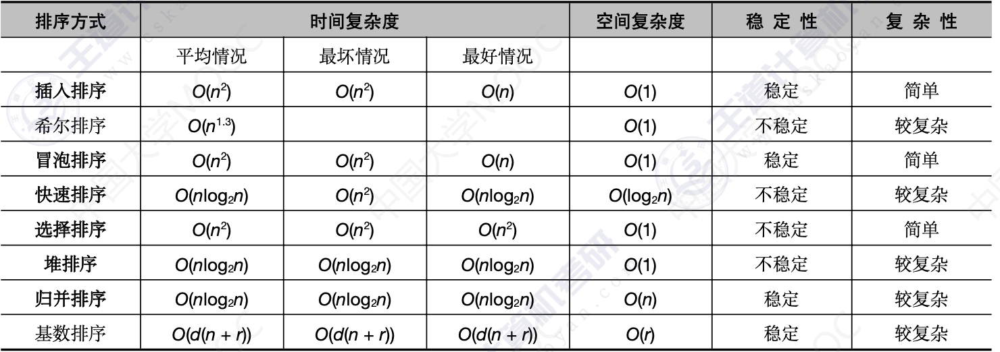

# 排序


## 1.交换排序

- 冒泡排序
- 快速排序


### 1.1 冒泡排序

**冒泡排序的原理比较简单，人生苦短，就跳过吧**

```cpp
#include <stdio.h>
#include <stdlib.h>
#include <time.h>
#include <string.h>

//定义了数据类型的结构体
typedef int Elemtype;
typedef struct {
    Elemtype *elem;
    int len;
} SSTable;


//初始化用来存放数组和数组长度的结构体
void STInit(SSTable &ST, int len) {
    ST.len = len;
    ST.elem = (Elemtype *) malloc(sizeof(Elemtype) * ST.len);
    int i;
    srand(time(NULL));
    for (i = 0; i < ST.len; i++) {
        ST.elem[i] = rand() % 100;
    }
}


//打印
void STPrint(SSTable ST) {
    for (int i = 0; i < ST.len; i++) {
        printf("%3d", ST.elem[i]);
    }
    printf("\n");
}


//交换
void swap(Elemtype &a, Elemtype &b) {
    Elemtype tmp;
    tmp = a;
    a = b;
    b = tmp;
}


//冒泡排序
void BubbleSort(Elemtype A[], int n)
{
    for (int i = 0;i<n;i++) // 外层循环，排序的round数，等于数组元素个数减1
    {
        for (int j=0; j<n-i-1;j++) // 内层循环，交换元素的比较次数，等于无序区的元素个数-1
        {
            if(A[j]>A[j+1])
            {
                swap(A[j],A[j+1]);
            }
        }
    }
}


int main()
{
    SSTable ST;
    STInit(ST,10);
    STPrint(ST);
    BubbleSort(ST.elem,ST.len);
    STPrint(ST);

}
```


### 1.2 快速排序

快速排序的核心是分治思想。

```
- 取一个元素p（一般取第一个元素），使得元素p归位

- 列表被p分为两部分，左边的都比p小，右边的都比p大

- 分别递归左边和右边
```


**partition 函数的思想：**

```
5 7 4 6 3 1 2 9 8
首先取第一个元素5，同时用指向除去5 以外的列表的头尾

_ 7 4 6 3 1 2 9 8
  |             |
  L             R
  
从右边起，找比5小的数放在_的位置
2 7 4 6 3 1 _ 9 8
  |         |   
  L         R
  
从左边起，找比5大的数放在_的位置
2 _ 4 6 3 1 7 9 8
  |         |   
  L         R
  
2 1 4 6 3 _ 7 9 8
  |       |   
  L       R
  
2 1 4 _ 3 6 7 9 8
      |   |   
      L   R
      
2 1 4 3 _ 6 7 9 8
        |   
       L R
       
一次partition的过程结束

2 1 4 3 5 6 7 9 8
        |   
       L R
-- 5 放在的他该在的位置
```


**partition 函数的实现：**

这里的partition函数使用直接覆盖的方式。

```cpp
int partition(Elemtype *A, int low, int high)
{
    Elemtype pivot=A[low];//拿最左边的元素作为分割值
    while (low<high)
    {
        //从后往前找一个比pivot小的值
        while (low<high && A[high]>=pivot)
        {
            high--;
        }
        A[low]=A[high];
        //从前往后找一个比pivot大的值
        while (low<high && A[low]<=pivot)
        {
            low++;
        }
        A[high]=A[low];
    }
    //外层循环结束之后low=high=留给pivot的空位
    A[low]=pivot;
    return low;
}
```

**测试partition函数：**

给定一个长度为10数组，测试partition函数是否可以将数组的第一个元素放置归位

（左边都小于该元素，右边都大于该元素）

```cpp
#include <stdio.h>
#include <stdlib.h>
#include <time.h>
#include <string.h>

typedef int Elemtype;
typedef struct {
    Elemtype *elem;
    int len;
} SSTable;


//初始化用来存放数组和数组长度的结构体
void STInit(SSTable &ST, int len) {
    ST.len = len;
    ST.elem = (Elemtype *) malloc(sizeof(Elemtype) * ST.len);
    int i;
    srand(time(NULL));
    for (i = 0; i < ST.len; i++) {
        ST.elem[i] = rand() % 100;
    }
}

void PrintST(SSTable ST) {
    for (int i = 0; i < ST.len; i++) {
        printf("%3d", ST.elem[i]);
    }
    printf("\n");
}

int main() {
    SSTable S;
    STInit(S, 10);
    Elemtype A[10] = {64, 94, 95, 79, 69, 84, 18, 22, 12, 78};
    memcpy(S.elem, A, sizeof(A));
    PrintST(S);
    partition(S.elem,0,9);
    PrintST(S);
    return 0;
}
```

**运行结果：**

```
/Users/uichuan/Documents/library/DataStructure/codes/Sort-QuickSort/cmake-build-debug/Sort_QuickSort
 64 94 95 79 69 84 18 22 12 78
 12 22 18 64 69 84 79 95 94 78
```

元素64成功放在它的位置。


**快速排序实现：**

```cpp
void QuickSort(Elemtype *A, int low, int high) {
    if (low<high)
    {
        int pivot_pos= partition(A,low,high);
        QuickSort(A,low,pivot_pos-1);
        QuickSort(A,pivot_pos+1,high);
    }
}
```

每次使用partition分成两部分，左右依次递归

**全部代码：**

```cpp
#include <stdio.h>
#include <stdlib.h>
#include <time.h>
#include <string.h>

typedef int Elemtype;
typedef struct {
    Elemtype *elem;
    int len;
} SSTable;


//初始化用来存放数组和数组长度的结构体
void STInit(SSTable &ST, int len) {
    ST.len = len;
    ST.elem = (Elemtype *) malloc(sizeof(Elemtype) * ST.len);
    int i;
    srand(time(NULL));
    for (i = 0; i < ST.len; i++) {
        ST.elem[i] = rand() % 100;
    }
}

void PrintST(SSTable ST) {
    for (int i = 0; i < ST.len; i++) {
        printf("%3d", ST.elem[i]);
    }
    printf("\n");
}

int partition(Elemtype *A, int low, int high)
{
    Elemtype pivot=A[low];//拿最左边的元素作为分割值
    while (low<high)
    {
        //从后往前找一个比pivot小的值
        while (low<high && A[high]>=pivot)
        {
            high--;
        }
        A[low]=A[high];
        //从前往后找一个比pivot大的值
        while (low<high && A[low]<=pivot)
        {
            low++;
        }
        A[high]=A[low];
    }
    //外层循环结束之后low=high=留给pivot的空位
    A[low]=pivot;
    return low;
}

void QuickSort(Elemtype *A, int low, int high) {
    if (low<high)
    {
        int pivot_pos= partition(A,low,high);
        QuickSort(A,low,pivot_pos-1);
        QuickSort(A,pivot_pos+1,high);
    }
}

int main() {
    SSTable S;
    STInit(S, 10);
    PrintST(S);
    QuickSort(S.elem,0,9);
    PrintST(S);
    return 0;
}
```


**快速排序的时间复杂度**

假如每次快速排序数组都被平均地一分为二，那么可以得出 QuickSort 递归的次数是 log2n，
第一次partition遍历次数为 n，分成两个数组后，每个数组遍历 n/2 次，加起来还是n。因此时间复杂度是O(nlog2n)。

如果每次我们仍然用最左边的数作为分割值，那么每次数组都不会二分，

导致递归n次，**所以快速排序最坏时间复杂度为n的平方**

为了避免这种情况，有时会首先随机选择一个下标，先将对应下标的值与最左边的元素交换，再进行partition操作。

因此快序最好和平均时间复杂度是O(log2n)，最差是O(n^2)


快排的空间复杂度是O(log2n)，因此递归的次数是log2n，每次递归都需要占用空间。


## 2.插入排序

- 直接插入排序
- 折半插入排序
- 希尔排序


### 2.1 直接插入排序

如果序列只有一个数，序列就是有序的。插入排序首先将第一个数视为有序序列。

然后后面9个数视为要依次插入的序列

**直接插入排序的实现：**

```cpp
void InsertSort(Elemtype *A,int n)
{
    int i,j,insertVal;
    for(i=1;i<n;i++)
    {
        insertVal=A[i];
        for(j=i-1;j>=0&&A[j]>insertVal;j--)
        {
            A[j+1]=A[j];
        }
        A[j+1]=insertVal;
    }
}
```

**全部代码：**

```cpp
#include <stdio.h>
#include <stdlib.h>
#include <time.h>

typedef int Elemtype;
typedef struct {
    Elemtype *elem;
    int len;
} SSTable;

//初始化用来存放数组和数组长度的结构体
void STInit(SSTable &ST, int len) {
    ST.len = len;
    ST.elem = (Elemtype *) malloc(sizeof(Elemtype) * ST.len);
    int i;
    srand(time(NULL));
    for (i = 0; i < ST.len; i++) {
        ST.elem[i] = rand() % 100;
    }
}

void PrintST(SSTable ST) {
    for (int i = 0; i < ST.len; i++) {
        printf("%3d", ST.elem[i]);
    }
    printf("\n");
}

void InsertSort(Elemtype *A,int n)
{
    int i,j,insertVal;
    for(i=1;i<n;i++)
    {
        insertVal=A[i];
        for(j=i-1;j>=0&&A[j]>insertVal;j--)
        {
            A[j+1]=A[j];
        }
        A[j+1]=insertVal;
    }
}

int main() {
    SSTable S;
    STInit(S,10);
    PrintST(S);
    InsertSort(S.elem,10);
    PrintST(S);
    return 0;
}
```

**运行结果：**

```cpp
/Users/uichuan/Documents/library/DataStructure/codes/Sort-InsertSort/cmake-build-debug/Sort_InsertSort
 44 74 14 15 86 10 33 86 16 65
 10 14 15 16 33 44 65 74 86 86

Process finished with exit code 0
```


**时间复杂度&空间复杂度：**

随着有序序列的不断增加，插入排序比较的次数也会增加。

插入排序的执行次数也是从1增加到n-1，总运行次数是n（n-1）/2。

**时间复杂度依然为O（n^2）**。

因为未使用额外的空间，所以空间复杂度为O(1).

如果数组本身有序，那么最好的时间复杂度就是O（n）。


## 3.选择排序

- 简单选择排序
- 堆排序


### 3.1简单选择排序

[选择排序演示🎈](https://www.cs.usfca.edu/~galles/visualization/ComparisonSort.html)

**选择排序的原理：**

有一组序列：

```
 19 21 79  9  8 81 76 91 83 44
 |
 min
```

假定第一个元素是最小值，依次遍历min之后的部分，

```
 19 21 79  9  8 81 76 91 83 44
           |
          min
```

找到最小值后与第一个元素交换

```
 9 21 79 19  8 81 76 91 83 44
    |
   min
```

假定第二个元素为最小值，依次遍历min之后的部分

```
 9 21 79 19  8 81 76 91 83 44
             |
            min
```

找到最小值后与第一个元素交换

```
 9 8  79 19 21 81 76 91 83 44
       |
      min
```

假定第三个元素为最小值，依次遍历min之后的部分

......依次循环


**选择排序的实现：**

```cpp
void SelectSort(Elemtype *A,int n)
{
    int i,j,min;//分别定义内外层的循环变量以及用于标识最小值的变量min
    for(i=0;i<n-1;i++)
    {
        // min现标注最小值
        min=i;
        for(j=i+1;j<n;j++)
        {
            // 如果找到应该小于min的，则min重新标注为那个值
            if(A[min]>A[j])
            {
                min=j;
            }
            //循环结束后，min标识的就是后续序列的最小值
        }
        //进行交换
        swap(A[i],A[min]);
    }
}
```

**全部代码：**

```cpp
#include <stdio.h>
#include <stdlib.h>
#include <time.h>
#include <string.h>

typedef int Elemtype;
typedef struct {
    Elemtype *elem;
    int len;
} SSTable;


//初始化用来存放数组和数组长度的结构体
void STInit(SSTable &ST, int len) {
    ST.len = len;
    ST.elem = (Elemtype *) malloc(sizeof(Elemtype) * ST.len);
    int i;
    srand(time(NULL));
    for (i = 0; i < ST.len; i++) {
        ST.elem[i] = rand() % 100;
    }
}

void PrintST(SSTable ST) {
    for (int i = 0; i < ST.len; i++) {
        printf("%3d", ST.elem[i]);
    }
    printf("\n");
}

void swap(Elemtype &a, Elemtype &b) {
    Elemtype tmp;
    tmp = a;
    a = b;
    b = tmp;
}

void SelectSort(Elemtype *A,int n)
{
    int i,j,min;
    for(i=0;i<n-1;i++)
    {
        min=i;
        for(j=i+1;j<n;j++)
        {
            if(A[min]>A[j])
            {
                min=j;
            }
        }
        swap(A[i],A[min]);
    }
}

int main()
{
    SSTable S;
    STInit(S,10);
    PrintST(S);
    SelectSort(S.elem,10);
    PrintST(S);
}
```


**选择排序的时间复杂度与空间复杂度：**

选择排序虽然减少了交换次数，但是循环比较的次数依然和冒泡排序是一样的，都是从1到N-1，

总运行次数为N（N-1）/2。

时间复杂度为O(n^2)

因为未使用额外的空间，所以空间复杂度为O(1)


### 3.2堆排序

[堆排序演示🎈](https://www.cs.usfca.edu/~galles/visualization/HeapSort.html)


#### 3.2.1前戏：堆

堆是一种基于树的数据结构。满足以下特性的树称为堆：

给定堆中任意结点P和c，若P是C的父结点，则P的值小于等于（大于等于）C的值。

- 小根堆（最小堆）：父节点小于子结点
- 大根堆（最大堆）：父节点大于子结点

堆最顶端的结点称为根结点，根节点没有父结点。

**将二叉树中的每个元素对应到数组下标，这样的数据结构称之为堆**


#### 3.2.2向下调整

针对一棵子树，使用向下调整函数，可以使一棵子树成为堆

**需要注意的点：**

- 左右孩子的边界问题
- 循环的终止条件

```cpp
void AdjustDown(Elemtype *A, int d, int len) {
    int dad = d;
    int son = 2 * dad + 1; //左孩子的下标
    while (son <= len) {
        if (son + 1 <= len && A[son] < A[son + 1]) {
            son++;
        }
        if (A[son] > A[dad]) {
            swap(A[son], A[dad]);
            dad = son;
            son = 2 * dad + 1;
        } else {
            break;
        }
    }
}
```


#### 3.2.3堆排序

```cpp
void HeapSort(Elemtype *A,int len)
{
    int i;
    //建立一个堆
    for(i=len/2;i>=0;i--)
    {
        AdjustDown(A,i,len);
    }
    //每次取最有一个元素与堆顶元素交换位置。
    //之后将len-1长度的数组进行向下调整。
    for(i=len;i>0;i--)
    {
        AdjustDown(A,0,i);
        swap(A[0],A[i]);
    }
}
```

**全部代码：**

```cpp
#include <stdio.h>
#include <stdlib.h>
#include <time.h>
#include <string.h>

typedef int Elemtype;
typedef struct {
    Elemtype *elem;
    int len;
} SSTable;


//初始化用来存放数组和数组长度的结构体
void STInit(SSTable &ST, int len) {
    ST.len = len;
    ST.elem = (Elemtype *) malloc(sizeof(Elemtype) * ST.len);
    int i;
    srand(time(NULL));
    for (i = 0; i < ST.len; i++) {
        ST.elem[i] = rand() % 100;
    }
}

void PrintST(SSTable ST) {
    for (int i = 0; i < ST.len; i++) {
        printf("%3d", ST.elem[i]);
    }
    printf("\n");
}

void swap(Elemtype &a, Elemtype &b) {
    Elemtype tmp;
    tmp = a;
    a = b;
    b = tmp;
}


//向下调整
void AdjustDown(Elemtype *A, int d, int len) {
    int dad = d;
    int son = 2 * dad + 1; //左孩子的下标
    while (son <= len) {
        if (son + 1 <= len && A[son] < A[son + 1]) {
            son++;
        }
        if (A[son] > A[dad]) {
            swap(A[son], A[dad]);
            dad = son;
            son = 2 * dad + 1;
        } else {
            break;
        }
    }
}

void HeapSort(Elemtype *A,int len)
{
    int i;
    for(i=len/2;i>=0;i--)
    {
        AdjustDown(A,i,len);
    }
    for(i=len;i>0;i--)
    {
        AdjustDown(A,0,i);
        swap(A[0],A[i]);
    }
}

int main() {
    SSTable ST;
    STInit(ST, 10);
//    Elemtype A[10] = {3, 87, 2, 93, 78, 56, 61, 38, 12, 40};
//    memcpy(ST.elem, A, sizeof(A));
    PrintST(ST);
    HeapSort(ST.elem,9);

    PrintST(ST);
}
```

```
/Users/uichuan/Documents/library/DataStructure/codes/Sort-HeapSort/cmake-build-debug/Sort_HeapSort
  7 69 95 16 75 70 89 98 12 81
  7 12 16 69 70 75 81 89 95 98

Process finished with exit code 0
```


**堆排序的时间复杂度与空间复杂度：**

AdjustDown函数的循环次数是log2n

HeapSort函数第一个for循环执行了n/2次

第一个for循环执行了n次

总计次数为3/2nlog2n次，因此时间复杂度是O（nlog2n）

堆排最好、最坏、平均时间复杂度都是 *O*(*n*log2*n*)。

堆排的空间复杂度是 *O*(1)，因为没有使用与 n 相关的额外空间。


## 4.归并排序

一个数组如果分两段有序，那么可以使用一次**归并**让整个数组有序。

例如：

```
A={1,5,7,9,    2,3,4,8} 分两段有序

需要申请一块额外的空间来存储排好序的数组。
```

### 4.1 Merge函数

通过一次merge函数的调用，可以使有序的两个小数组合并成一个有序数组。


**merge函数的实现：**

```cpp
void Merge(Elemtype *A, int low, int mid, int high) {
    static Elemtype B[N];
    int i, j, k;
    // 复制元素
    for (k = low; k <= high; k++) {
        B[k] = A[k];
    }
    for (i = low, j = mid + 1, k = i; i <= mid && j <= high; k++) {
        if (B[i] < B[j]) {
            A[k] = B[i++];
        } else {
            A[k] = B[j++];
        }
    }
    //剩下一部分直接放入有序数组
    while (i <= mid) {
        A[k++] = B[i++];
    }
    while (j <= high) {
        A[k++] = B[j++];
    }
}
```

**测试代码：**

```cpp
#include <stdio.h>
#include <stdlib.h>
#include <time.h>

#define N 7
typedef int Elemtype;

void PrintArr(Elemtype *A,int len)
{
    for(int i=0;i<len;i++)
    {
        printf("%3d",A[i]);
    }
    printf("\n");
}

void Merge(Elemtype *A, int low, int mid, int high) {
    static Elemtype B[N];
    int i, j, k;
    // 复制元素
    for (k = low; k <= high; k++) {
        B[k] = A[k];
    }
    for (i = low, j = mid + 1, k = i; i <= mid && j <= high; k++) {
        if (B[i] < B[j]) {
            A[k] = B[i++];
        } else {
            A[k] = B[j++];
        }
    }
    //剩下一部分直接放入有序数组
    while (i <= mid) {
        A[k++] = B[i++];
    }
    while (j <= high) {
        A[k++] = B[j++];
    }
}
int main() {
    Elemtype A[] = {1, 5, 7, 9, 2, 3, 4, 8};
    PrintArr(A,8);
    Merge(A,0,3,7);
    PrintArr(A,8);
    return 0;
}
```


### 4.2 归并排序的递归实现

**MergeSort函数的实现：**

总体思路

- 将整个数组分成左右两部分
- 左右两部分分别递归进行归并排序
- Merge合并左右两部分已经有序的小数组

最后通过merge得到最终的有序数组。

```cpp
void MergeSort(Elemtype *A,int low,int high)
{
    if (low<high)
    {
        int mid=(low+high)/2;
        MergeSort(A,low,mid);
        MergeSort(A,mid+1,high);
        Merge(A,low,mid,high);
    }
}
```

**全部代码：**

```cpp
#include <stdio.h>
#include <stdlib.h>
#include <time.h>

#define N 7
typedef int Elemtype;

void PrintArr(Elemtype *A,int len)
{
    for(int i=0;i<len;i++)
    {
        printf("%3d",A[i]);
    }
    printf("\n");
}

void Merge(Elemtype *A, int low, int mid, int high) {
    static Elemtype B[N];
    int i, j, k;
    // 复制元素
    for (k = low; k <= high; k++) {
        B[k] = A[k];
    }
    for (i = low, j = mid + 1, k = i; i <= mid && j <= high; k++) {
        if (B[i] < B[j]) {
            A[k] = B[i++];
        } else {
            A[k] = B[j++];
        }
    }
    //剩下一部分直接放入有序数组
    while (i <= mid) {
        A[k++] = B[i++];
    }
    while (j <= high) {
        A[k++] = B[j++];
    }


}

void MergeSort(Elemtype *A,int low,int high)
{
    if (low<high)
    {
        int mid=(low+high)/2;
        MergeSort(A,low,mid);
        MergeSort(A,mid+1,high);
        Merge(A,low,mid,high);
    }
}
int main() {
    Elemtype A[] = {1, 5, 7, 9, 2, 3, 4, 8};
    printf("--------Merge Test--------\n");
    PrintArr(A,8);
    Merge(A,0,3,7);
    PrintArr(A,8);
    printf("--------MergeSort Test--------\n");
    Elemtype Arr[] = {2,1,5,4,6,9,7,3};
    PrintArr(Arr,8);
    MergeSort(Arr,0,7);
    PrintArr(Arr,8);
    return 0;
}
```

**测试结果：**

```cpp
/Users/uichuan/Documents/library/DataStructure/codes/Sort-MergeSort/cmake-build-debug/Sort_MergeSort
--------Merge Test--------
  1  5  7  9  2  3  4  8
  1  2  3  4  5  7  8  9
--------MergeSort Test--------
  2  1  5  4  6  9  7  3
  1  2  3  4  5  6  7  9

Process finished with exit code 0
```


**时间复杂度与空间复杂度：**

MergeSort函数的递归次数为log2n，

Merge函数循环了n次，因此时间复杂度是O(nlog2n)

归并排序最好，最坏，平均时间复杂度都是O(nlog2n)

归并排序的空间复杂度是O(n)，因为在Merge函数的过程中使用了另外的一个等长数组。


## 5.排序算法时间&空间复杂度汇总




