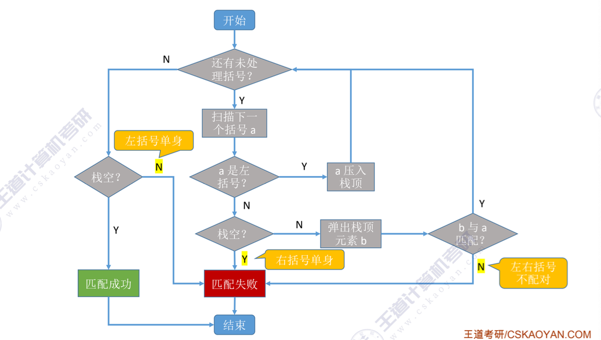
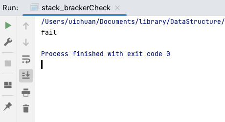

# 栈

栈：只允许在一段进行**插入或者删除**操作的线性表

（First in last out）


### 1.栈的顺序表示

```cpp
int main(){
    SqStack S;
    InitStack(S);
    Push(S,1);
    Push(S,2);
    Push(S,3);
    ElemType res;
    Pop(S,res);
    printf("pop_res->%d\n",res);
    return 0;
}
```

#### 初始化栈

```cpp
#include <stdio.h>
#include <stdlib.h>

#define MaxSize 50
typedef int ElemType;
typedef struct {
    ElemType data[MaxSize];
    int top;
}SqStack;

void InitStack(SqStack &S)
{
    S.top=-1;
}
```


#### 判断栈是否为空

```cpp
bool StackEmpty(SqStack S)
{
    if(S.top==-1)
    {
        return true;
    } else{
        return false;
    }
}
```


#### 向栈中增加元素

```cpp
bool Push(SqStack &S,ElemType x)
{
    if(S.top==MaxSize-1)
    {
        return false;
    }
    S.data[++S.top]=x;
    return true;
}
```


#### 取栈顶元素

```cpp
bool GetTop(SqStack S,ElemType &x)
{
    if(S.top==-1)
    {
        return false;
    }
    x=S.data[S.top];
    return true;
}
```


#### 弹出栈顶元素

```cpp
bool Pop(SqStack &S,ElemType &x)
{
    if(S.top==-1)
    {
        return false;
    }
    x=S.data[S.top--];
    return true;
}
```


### 2.栈的链式表示

```cpp
#include <stdio.h>
#include <stdlib.h>


typedef int element_type;
typedef struct LStack{
    element_type data;
    struct LStack *next;
}LStack,*LinkStack;
```

```cpp
int main()
{
    LinkStack S;
    InitStack(S);
    element_type insert_num_1,insert_num_2,insert_num_3;
    insert_num_1 = 1;
    insert_num_2 = 2;
    insert_num_3 = 3;
    Push(S,insert_num_1);
    Push(S,insert_num_2);
    Push(S,insert_num_3);
    PrintLStack(S);
}
```

```cpp
bool InitStack(LinkStack &S)
{
    S = (LinkStack) malloc(sizeof (LStack));
    S->next = NULL;
    return true;
}

bool Push(LinkStack &S,element_type e)
{
    LinkStack new_one;
    new_one = (LinkStack) malloc(sizeof (LStack));
    new_one->data = e;
    new_one->next = S->next;
    S->next = new_one;
}

void PrintLStack(LinkStack S)
{
    LinkStack point;
    point = S->next;
    while (point!=NULL)
    {
        printf("%3d\n",point->data);
        point = point->next;
    }
}
```


### 3.栈的应用-括号匹配



实现代码：

```cpp
#include <stdio.h>

#define MaxSize 50
typedef char ElemType;
typedef struct {
    ElemType data[MaxSize];
    int top;
}SqStack;

void InitStack(SqStack &S)
{
    S.top=-1;
}

bool StackEmpty(SqStack S)
{
    if(S.top==-1)
    {
        return true;
    } else{
        return false;
    }
}

bool Push(SqStack &S,ElemType x)
{
    if(S.top==MaxSize-1)
    {
        return false;
    }
    S.data[++S.top]=x;
    return true;
}

bool Pop(SqStack &S,ElemType &x)
{
    if(S.top==-1)
    {
        return false;
    }
    x=S.data[S.top--];
    return true;
}

bool GetTop(SqStack S,ElemType &x)
{
    if(S.top==-1)
    {
        return false;
    }
    x=S.data[S.top];
    return true;
}

bool bracketCheck(char str[],int length)
{
    SqStack S;
    InitStack(S);
    for(int i=0;i<length;i++)
    {
        if(str[i] == '(' || str[i] == '[' || str[i] == '{')
        {
            Push(S,str[i]);
        } else{
            if(StackEmpty(S))
            {
                return false;
            }
            char topElem;
            Pop(S,topElem);
            if(str[i] == ')' && topElem != '(')
            {
                return false;
            }
            if(str[i] == ']' && topElem != '[')
            {
                return false;
            }
            if(str[i] == '}' && topElem != '{')
            {
                return false;
            }
        }
    }
    return StackEmpty(S);
}

int main(){
    bool res;
    res = bracketCheck("()()(",5);
    if(res)
    {
        printf("match\n");
    } else{
        printf("fail\n");
    }
    return 0;
}
```

