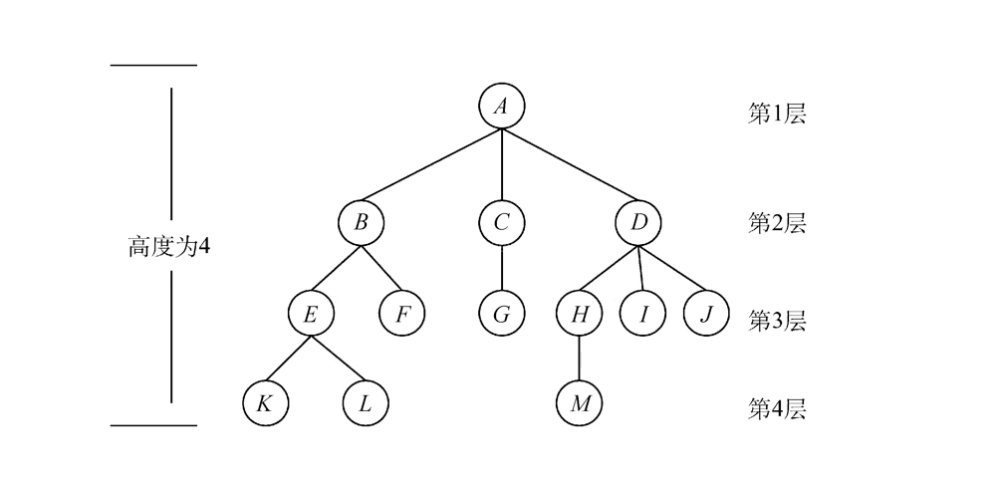
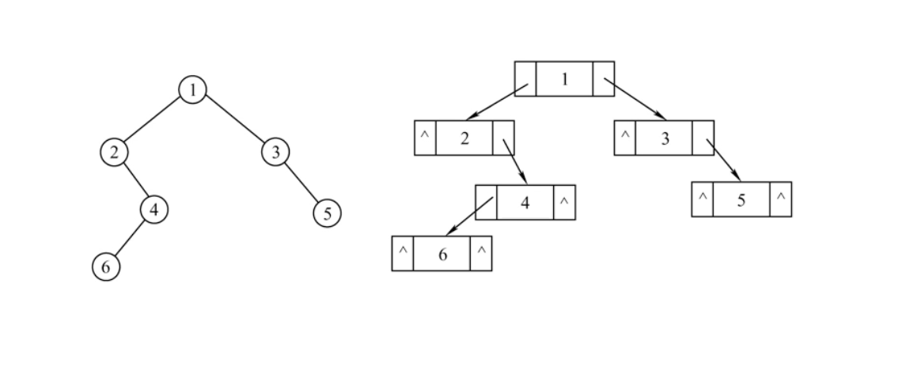
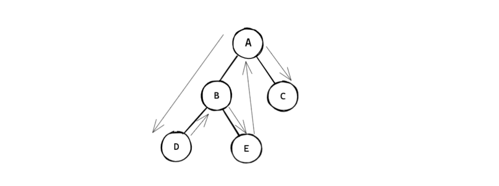

# 树 (Tree)

树是n（n>=0）个节点的有限集，当n=0时，称为空树，

​	在任意一棵非空树中应该满足：

- 有且仅有一个特定的称为根的节点
- 当n>1时，其余节点可以分为m个互不相交的有限集 T1,T2,...,Tm，每个集合本身又是一棵树，并且称为根的子树

​	（以上是树的递归定义）



```
树作为一种逻辑结构，同时也是一种分层结构
	- 树的根节点没有前驱，除去根节点以外，树的每一个节点都有且只有一个前驱
	- 树的所有节点都可以有0个或者多个后继
```


### 1. 前戏

二叉树是树，但二叉树的每个节点上最多有两棵子树（即二叉树中不存在度大于2的节点），

并且二叉树的子树有左右之分，不能颠倒顺序，

同时，二叉树也遵守树的递归定义


**满二叉树与完全二叉树**


每一层的节点数都满足2^(层数-1)，就是满二叉树

### 2. 二叉树的链式存储

​	树节点的数据结构

​	使用链式结构实现



```cpp
typedef char BiElemtype
typedef struct BiTNode{
    BiElemtype c;
    struct BiTNode *lchild;
    struct BiTNode *rchild;
}BiTNOde,*BiTree;
```


```cpp
typedef struct tage{
    BiTree p;
    struct tag *pnext;
}tag_t,*ptag_t;
```


### 3.二叉树的建立过程

层次建立二叉树，必须使用**辅助队列**

**步骤大致如下：**

1. 声明二叉树的新结点，树根（结构体指针）

2. 声明辅助队列的头节点，尾节点，新节点，当前节点（结构体指针）
3. 进入循环
4. 为辅助队列插入新的辅助队列节点，同时尾指针后移ptail=ptail->next
5. 每次判断当前插入的节点（pcur）指向的节点的左右孩子节点是否为空
6. 当右孩子节点被插入后，pcur=pcur->next


**代码：**

function.h

```cpp
//
// Created by 王一川 on 2022/11/17.
//

#ifndef CREATE_TREE_FUNCTION_H
#define CREATE_TREE_FUNCTION_H

#endif //CREATE_TREE_FUNCTION_H

#include <stdio.h>
#include <stdlib.h>

typedef char BiElemType;
typedef struct BiTNode {
    BiElemType c;//c 就是书籍上的 data struct BiTNode *lchild;
    struct BiTNode *rchild;
    struct BiTNode *lchild;
} BiTNode, *BiTree;
//tag 结构体是辅助队列使用的
typedef struct tag {
    BiTree p;//树的某一个结点的地址值
    struct tag *pnext;
} tag_t, *ptag_t;
```

main.cpp

```cpp
#include "function.h"

int main() {

    BiTree pnew;
    char c;
    //初始化树根为空
    BiTree tree = NULL;
    //辅助队列
    ptag_t phead = NULL, ptail = NULL, listpnew = NULL, pcur = NULL;

    while (scanf("%c", &c)) {
        if (c == '\n') {
            break;
        }
        pnew = (BiTree) calloc(1, sizeof(BiTNode));
        pnew->c = c;
        //给辅助队列节点申请空间
        listpnew = (ptag_t) calloc(1, sizeof(tag_t));
        listpnew->p = pnew;
        if (NULL == tree) {
            tree = pnew;
            phead = listpnew;
            ptail = listpnew;
            pcur = listpnew;
            continue;
        } else {
            ptail->pnext = listpnew;
            ptail = listpnew;
        }

        if (NULL == pcur->p->lchild) {
            pcur->p->lchild = pnew;
        } else if (NULL == pcur->p->rchild) {
            pcur->p->rchild = pnew;
            pcur = pcur->pnext;
        }
    }
    return 0;
}
```


### 4.二叉树的遍历


#### 1.遍历的递归算法

如果二叉树为空

1. 访问根节点
2. 前序遍历左子树
3. 前序遍历右子树


- 前序遍历

```cpp
void preOrder(BiTree p)
{
	if(p!=NULL)
    {
        putchar(p->c);
        preOrder(p->lchild);
        preOrder(p->rchild);
    }
}
```

- 中序遍历

```cpp
void InOrder(BiTree p)
{
	if(p!=NULL)
    {
        InOrder(p->lchild);
        putchar(p->c);
        InOrder(p->rchild);
    }
}
```

- 后序遍历

```cpp
void PostOrder(BiTree p)
{
	if(p!=NULL)
    {
        PostOrder(p->lchild);
        PostOrder(p->rchild);
        putchar(p->c);
    }
}
```


#### 2.中序遍历的非递归算法

**中序非递归遍历的过程：**

1. 沿着根节点的左孩子节点深入并且依次入栈，直到左孩子节点为空
2. 输出此时的栈顶元素并且pop栈顶元素
3. 如果右孩子节点为空则执行step2，如果右孩子不为空，找右孩子的最左节点
4. 循环结束，所有元素出栈



**代码：**

中序非递归遍历

```cpp
void InOrder(BiTree T)
{
    SqStack S;
    InitStack(S);
    BiTree p=T;
    while (p||!StackEmpty(S))
    {
        if(p)
        {
            Push(S,p);
            p=p->lchild;
        } else{
            Pop(S,p);
            putchar(p->c);
            p=p->rchild;
        }
    }
}
```

辅助栈

```cpp
#include <stdio.h>
#include <stdlib.h>

#define MaxSize 50
typedef BiTree ElemType;
typedef struct {
    ElemType data[MaxSize];
    int top;
}SqStack;
void InitStack(SqStack &S);
bool StackEmpty(SqStack S);
bool Push(SqStack &S,ElemType x);
bool Pop(SqStack &S,ElemType &x);
bool GetTop(SqStack S,ElemType &x);
```

全部代码：

function.h

```cpp
//
// Created by 王一川 on 2022/11/18.
//

#ifndef TREE_NONRECURSIVE_FUNCTION_H
#define TREE_NONRECURSIVE_FUNCTION_H

#endif //TREE_NONRECURSIVE_FUNCTION_H
#include <stdio.h>
#include <stdlib.h>
typedef char BiElemType;
typedef struct BiTNode {
    BiElemType c;
    struct BiTNode *rchild;
    struct BiTNode *lchild;
} BiTNode, *BiTree;

typedef struct tag {
    BiTree p;
    struct tag *pnext;
} tag_t, *ptag_t;

#include <stdio.h>
#include <stdlib.h>

#define MaxSize 50
typedef BiTree ElemType;
typedef struct {
    ElemType data[MaxSize];
    int top;
}SqStack;
void InitStack(SqStack &S);
bool StackEmpty(SqStack S);
bool Push(SqStack &S,ElemType x);
bool Pop(SqStack &S,ElemType &x);
bool GetTop(SqStack S,ElemType &x);
```

stack.cpp

```cpp
#include "function.h"
void InitStack(SqStack &S)
{
    S.top=-1;
}

bool StackEmpty(SqStack S)
{
    if(S.top==-1)
    {
        return true;
    } else{
        return false;
    }
}

bool Push(SqStack &S,ElemType x)
{
    if(S.top==MaxSize-1)
    {
        return false;
    }
    S.data[++S.top]=x;
    return true;
}

bool Pop(SqStack &S,ElemType &x)
{
    if(S.top==-1)
    {
        return false;
    }
    x=S.data[S.top--];
    return true;
}

bool GetTop(SqStack S,ElemType &x)
{
    if(S.top==-1)
    {
        return false;
    }
    x=S.data[S.top];
    return true;
}
```

main.cpp

```cpp
#include "function.h"
//中序非递归遍历

void InOrder(BiTree T)
{
    SqStack S;
    InitStack(S);
    BiTree p=T;
    while (p||!StackEmpty(S))
    {
        if(p)
        {
            Push(S,p);
            p=p->lchild;
        } else{
            Pop(S,p);
            putchar(p->c);
            p=p->rchild;
        }
    }
}

int main() {
    BiTree pnew;
    BiTree tree=NULL;
    ptag_t phead = NULL, ptail = NULL, listpnew = NULL, pcur = NULL;
    char c;

    while (scanf("%c", &c)) {
        if (c == '\n') {
            break;
        }
        pnew = (BiTree) calloc(1, sizeof(BiTNode));
        pnew->c = c;
        listpnew = (ptag_t) calloc(1, sizeof(tag_t));
        listpnew->p = pnew;
        if (NULL == tree) {
            tree = pnew;
            phead = listpnew;
            ptail = listpnew;
            pcur = listpnew;
            continue;
        } else{
            ptail->pnext=listpnew;
            ptail=listpnew;
        }

        if(NULL== pcur->p->lchild)
        {
            pcur->p->lchild=pnew;
        } else if(NULL== pcur->p->rchild)
        {
            pcur->p->rchild=pnew;
            pcur=pcur->pnext;
        }
    }
    InOrder(tree);
    return 0;
}
```


#### 3.层序遍历算法

层次遍历必须使用辅助队列

**层序遍历的过程：**

1. 将树根入队
2. 进入循环，每次循环队列出队一次
3. 出队之后判断左右子树是否为空，不为空则入队
4. 循环的条件是队列中还有节点（元素）

层序遍历的结果会将元素按照**广度优先遍历**输出

**代码：**

层序遍历函数

```cpp
void LevelOrder(BiTree T)
{
    LinkQueue Q;
    InitQueue(Q);
    BiTree p; //用来接收出队的元素
    EnQueue(Q,T);
    while (!IsEmpty(Q))
    {
        DeQueue(Q,p);
        putchar(p->c);
        if(p->lchild)
        {
            EnQueue(Q,p->lchild);
        }
        if(p->rchild)
        {
            EnQueue(Q,p->rchild);
        }
    }
}
```


function.h

```cpp
//
// Created by 王一川 on 2022/11/18.
//

#ifndef TREE_HIERARCHICTRAVERSAL_FUNCTION_H
#define TREE_HIERARCHICTRAVERSAL_FUNCTION_H

#endif //TREE_HIERARCHICTRAVERSAL_FUNCTION_H
#include <stdio.h>
#include <stdlib.h>
typedef char BiElemType;
typedef struct BiTNode {
    BiElemType c;
    struct BiTNode *rchild;
    struct BiTNode *lchild;
} BiTNode, *BiTree;

typedef struct tag {
    BiTree p;
    struct tag *pnext;
} tag_t, *ptag_t;

//队列的结构体
typedef BiTree ElemType;
typedef struct LinkNode {
    ElemType data;
    struct LinkNode *next;
} LinkNode, *LinkList;

typedef struct LinkQueue {
    LinkNode *front, *rear;
} LinkQueue;

void InitQueue(LinkQueue &Q);
void EnQueue(LinkQueue &Q, ElemType x);
bool IsEmpty(LinkQueue Q);
bool DeQueue(LinkQueue &Q, ElemType &element);
```

main.cpp

```cpp
#include "function.h"

void PreOrder(BiTree p)
{
    if(p!=NULL)
    {
        putchar(p->c);
        PreOrder(p->lchild);
        PreOrder(p->rchild);
    }
}

void LevelOrder(BiTree T)
{
    LinkQueue Q;
    InitQueue(Q);
    BiTree p;
    EnQueue(Q,T);
    while (!IsEmpty(Q))
    {
        DeQueue(Q,p);
        putchar(p->c);
        if(p->lchild)
        {
            EnQueue(Q,p->lchild);
        }
        if(p->rchild)
        {
            EnQueue(Q,p->rchild);
        }

    }
}

int main() {
    BiTree pnew;
    BiTree tree=NULL;
    ptag_t phead = NULL, ptail = NULL, listpnew = NULL, pcur = NULL;
    char c;

    while (scanf("%c", &c)) {
        if (c == '\n') {
            break;
        }
        pnew = (BiTree) calloc(1, sizeof(BiTNode));
        pnew->c = c;
        listpnew = (ptag_t) calloc(1, sizeof(tag_t));
        listpnew->p = pnew;
        if (NULL == tree) {
            tree = pnew;
            phead = listpnew;
            ptail = listpnew;
            pcur = listpnew;
            continue;
        } else{
            ptail->pnext=listpnew;
            ptail=listpnew;
        }

        if(NULL== pcur->p->lchild)
        {
            pcur->p->lchild=pnew;
        } else if(NULL== pcur->p->rchild)
        {
            pcur->p->rchild=pnew;
            pcur=pcur->pnext;
        }
    }
    printf("-------PreOrder-------\n");
    PreOrder(tree);
    printf("\n");
    printf("-------LevelOrder-------\n");
    LevelOrder(tree);
    printf("\n");
    return 0;
}
```


### 5.tree-2014-41

41.(13分) 二叉树的带权路径长度(WPL)是二叉树中所有叶结点的带权路径长度

之和。给定一棵二叉树 T，采用二叉链表存储，结点结构如下:

`left|weight|right`

其中叶节点的weight域保存该节点的非负权值。设root为指向T的根节点的指针，请设计求T的WPL算法，要求：

1. 给出算法的基本设计思想
2. 使用C/C++语言，给出二叉树节点的数据类型定义
3. 根据设计思想，采用C/C++语言描述算法


>树的带权路径长度(Weighted Path Length of Tree，简记为 WPL 考查二叉树的带权路径长度，二叉树的带权路径长度为每个叶子结点的深度与权值之积的总和，可以使用先序遍历或层次遍历解决问题。

- 算法的设计思想

基于先序递归遍历的算法思想是用一个 static 变量记录 wpl，

把每个结点的深度作为 递归函数的一个参数传递，

算法步骤如下:

若该结点是叶子结点，那么变量 wpl 加上该结点的深度与权值之积; 

若该结点非叶子结点，那么若左子树不为空，对左子树调用递归算法，

若右子树不为空， 对右子树调用递归算法，深度参数均为本结点的深度参数加一;

最后返回计算出的 wpl 即可。

- 二叉树节点的数据类型定义

```cpp
typedef int BiElemType;
typedef struct BiTNode{
    BiElemType weight; 
    struct BiTNode *lchild;
    struct BiTNode *rchild;
}BiTNode,*BiTree;
```

- C++描述

function.h

```cpp
//
// Created by 41507 on 2022/11/9.
//

#ifndef INC_1_TREE_FUNCTION_H
#define INC_1_TREE_FUNCTION_H
#include <stdio.h>
#include <stdlib.h>

typedef int BiElemType;
typedef struct BiTNode{
    BiElemType weight;//c就是书籍上的data
    struct BiTNode *lchild;
    struct BiTNode *rchild;
}BiTNode,*BiTree;

//tag结构体是辅助队列使用的
typedef struct tag{
    BiTree p;//树的某一个结点的地址值
    struct tag *pnext;
}tag_t,*ptag_t;
#endif //INC_1_TREE_FUNCTION_H
```

main.cpp

```cpp
#include "function.h"

//int wpl=0;
//前序遍历，也叫先序遍历，也是深度优先遍历
int PreOrder(BiTree p,int deep)
{
    static int wpl=0;//只会初始化一次
    if(p!=NULL)
    {
//        printf("ele%c--%d\n", p->c,deep);
        if(p->lchild==NULL&&p->rchild==NULL)
        {
            wpl=wpl+p->weight*deep;
        }
        PreOrder(p->lchild,deep+1);//打印左子树
        PreOrder(p->rchild,deep+1);//打印右子树
    }
    return wpl;
}

int main() {
    BiTree pnew;//用来指向新申请的树结点
    BiTree tree=NULL;//tree是指向树根的，代表树
    char c;
    ptag_t phead=NULL,ptail=NULL,listpnew=NULL,pcur;
    //abcdefghij
    while(scanf("%c",&c))
    {
        if(c=='\n')
        {
            break;//读取到换行就结束
        }
        //calloc申请的空间大小是两个参数直接相乘，并对空间进行初始化，赋值为0
        pnew= (BiTree)calloc(1,sizeof(BiTNode));
        pnew->weight=c;
        listpnew= (ptag_t)calloc(1,sizeof(tag_t));//给队列结点申请空间
        listpnew->p=pnew;
        //如果是树的第一个结点
        if(NULL==tree)
        {
            tree=pnew;//tree指向树的根结点
            phead=listpnew;//第一个结点即是队列头，也是队列尾
            ptail=listpnew;
            pcur=listpnew;//pcur要指向要进入树的父亲元素
        }else{
            //让元素先入队列
            ptail->pnext=listpnew;
            ptail=listpnew;
            //接下来把结点放入树中
            if(NULL==pcur->p->lchild)
            {
                pcur->p->lchild=pnew;//pcur->p左孩子为空，就放入左孩子
            }else if(NULL==pcur->p->rchild)
            {
                pcur->p->rchild=pnew;//pcur->p右孩子为空，就放入右孩子
                pcur=pcur->pnext;//当前结点左右孩子都有了，pcur就指向下一个
            }
        }
    }
    printf("--------PreOrder----------\n");//也叫先序遍历，先打印当前结点，打印左孩子，打印右孩子
    printf("wpl=%d\n",PreOrder(tree,0));//wpl统计的是路径，因此一开始应该传入的是0
    return 0;
}
```

